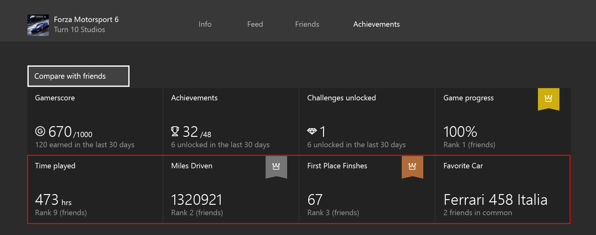

# Configuring title-managed Featured Stats & Leaderboards in Partner Center

<!-- was https://docs.microsoft.com/gaming/xbox-live/configure-xbl/dev-center/featured-stats-and-leaderboards -->

For a game to interact with the stats service, a stat needs to be defined in [Partner Center](https://partner.microsoft.com/dashboard).
All Featured Stats will show up on the GameHub, which makes it automatically act as a leaderboard.

We will store the raw value; however, the game will own the logic for determining whether a new value should be provided.

The picture above shows how Featured Stats will look in your title's GameHub.
The Featured Stats are shown withing the red box.

With title-managed Player Data, you only need to configure a stat which is used for a social leaderboard that is featured on a player's GameHub page.

You can use Partner Center to configure a featured stat and leaderboard that is associated with your game.

**To add configuration:**

1. Navigate to the **Featured Stats and Leaderboards** section for your title, located under **Services** > **Xbox Live** > **Featured Stats and Leaderboards**.

2. Click the **New** button which will open a modal form. Once filled out, click **Save**.

The **Display name** field is what users will see in the GameHub.
This string can be localized in the **Localize strings** of the Xbox Live service configuration.

The **ID** field is the stat name and is how you will refer to your stat when updating it from your code.
For more details, see [Updating title-managed Stats](../how-to/live-stats-tm-updating.md).

## Data format

The **Format** is the data format of the stat.
Data format options are Integer, Decimal, Percentage, Short timespan, Long timespan and Sort.

Each **Format** option will give some information on acceptable values or formatting under the drop-down, when selected.

| Format Option | Description |
|---------|-------------|
| Integer stats | Whole numbers like 1, 2, or 100. |
| Decimal stats | Fractional numbers with two decimal places like 1.05 or 12.00 |
| Percentage stats | Whole numbers between 0 and 100. '%' will be appended to the end of the whole number. Examples: 0%, 100%. |
| Short timespan stats | Use the HH:MM:SS format like 02:10:30, and will ask you to provide a time unit for the stat. The available time units are milliseconds, seconds, minutes, hours, and days. |
| Long timespan stats | Use the Xd Xh Xm format like 1d 2h 10m, this stat will also ask you to provide a time unit for the stat. |
| Sort field | Lets you change the sort order of the leaderboard to be either ascending or descending. |

<!-- gdk has:
Developers are limited to having no more than 20 featured stats for their title, but there is no requirement for developers to include Featured Stats in their title.
-->
<!-- public instead has: -->
There are the following requirements when configuring a featured stat and leaderboard:

| Developer Type | Requirement | Limit |
|----------------|-------------|-------|
| Creators Program | There is no requirement to designate any stats as Featured Stats | 20 |
| Managed Partners | You must designate at least 3 Featured Stats | 20 |

## Next steps

Next, update the stats from your code; see [Updating title-managed Stats](../how-to/live-stats-tm-updating.md).
