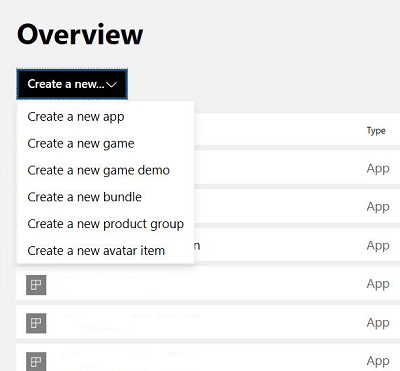
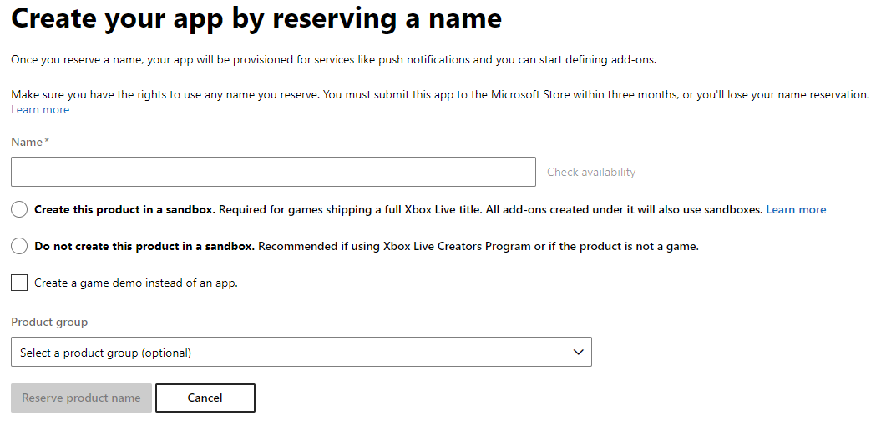
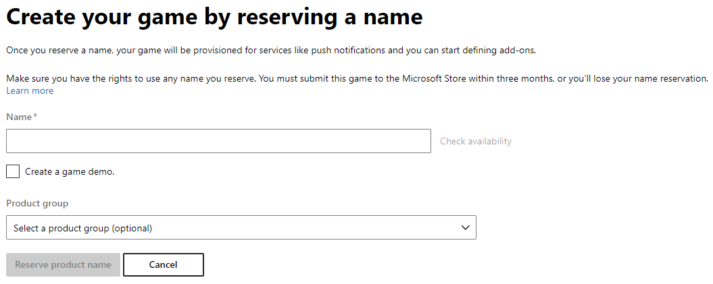
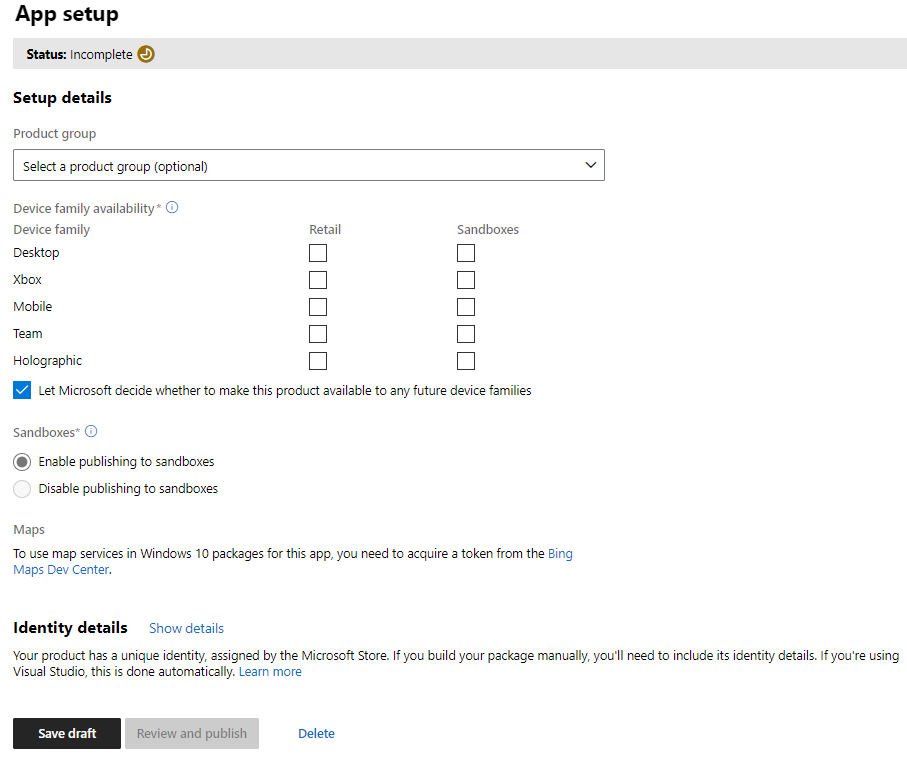
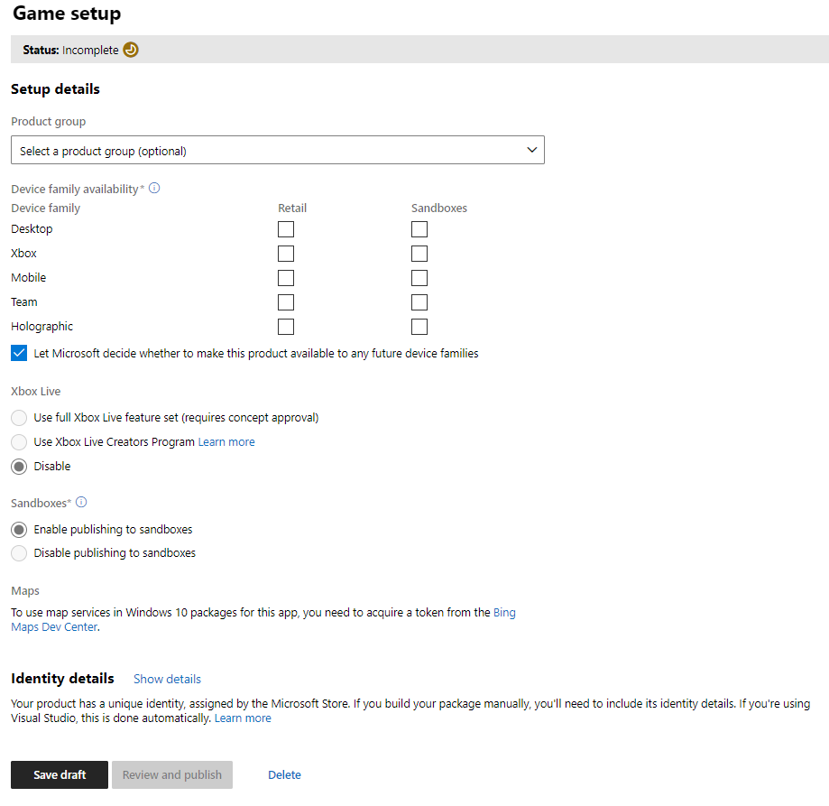
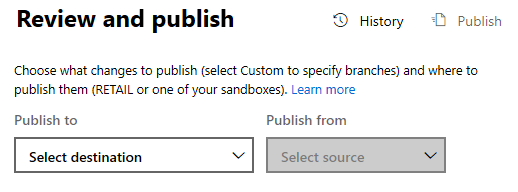
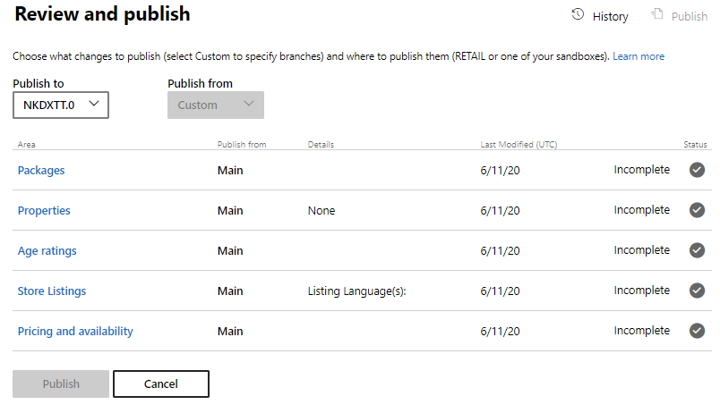
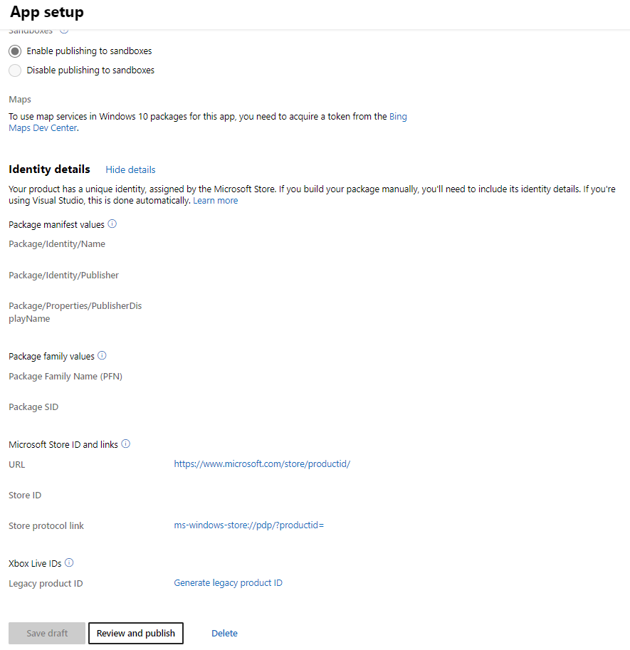

# Setting up an app or game at Partner Center, for Managed Partners

To add Xbox Live functionality to your app or game, start by setting up a product definition in Partner Center, by following the steps below.

<!-- **Contents:**
* [1. Create the initial product definition at Partner Center](#ctipdapc)
* [2. Contact your Microsoft Representative to Xbox Live-enable the app or game](#cymrtxletaog)
* [3. Publish the game](#ptg)
-->

## Prerequisites

* Have a prototype of your app or game, such as a demo and screen captures.

<!-- public only: * [Joining the ID@Xbox Program](../join-dev-program/live-join-id-program.md).  -->

<!--========================================================================-->

## 1. Create the initial product definition at Partner Center

1. Go to <a href="https://partner.microsoft.com/dashboard/" target="_blank">Partner Center</a>. The Partner Center dashboard Home page appears.

2. Navigate to **Windows & Xbox** > **Overview**. The "Overview" page appears.

3. Click the **Create a new...** button, then select a product type, such as app, game, or game demo.

   

4. The "Create your app by reserving a name" page appears:

   

   Or, the "Create your game by reserving a name" page appears:

   

5. In the **Name** text box, enter the name of your game or app.

   If you want your product to include a reduced, demo version of your game, select the **Create a game demo** check box so that a checkmark appears.

   If you know your Product Group, click the **Product Group** drop-down list and then click your Product Group.

6. Click the **Reserve product name** button. A "Setup" page appears, and initially the top of the page reads "Status: Incomplete":

   **Figure: The "App setup" page:**

   

   **Figure: The "Game setup" page:**

   

7. Select settings for your product. For example, in the **Device family availability** section, you can select the **Xbox > Retail** check box.

8. At the bottom of the "Setup" page, click the **Save draft** button.  The top of the page now reads "Status: Complete", and the **Review and publish** button becomes available.

9. Click the **Review and publish** button.  The "Review and publish" page appears.

   

10. In the **Publish to** drop-down list, select a sandbox. Sections are added to the page:

    

Follow the onscreen Partner Center setup steps for your product.
Once your app or game reaches the Completed state, contact your Microsoft Representative to enable your game, as follows.

<!--========================================================================-->

## 2. Contact your Microsoft Representative to Xbox Live-enable the app or game

1. In Partner Center, select your app or game.  

   The "Application overview" or "Game overview" page appears.

2. Click **App setup** or **Game setup**.  The "App setup" page or "Game setup" page appears.

3. Toward the bottom of the page, click the **Identity details** link. The "Identity details" section expands:

   

4. Copy the **Store ID**.

5. Contact your Microsoft representative to ask them to add Xbox Live capability to your title.
   Include the store ID.
   For example:

   * **Subject**: Need to enable game for Xbox Live

   * **Body**: "Hi support, I would like to enable my Partner Center product.  The store ID is [your game's store ID]."

Your Microsoft representative emails you telling you that your app or game has been enabled in Partner Center.

The initial setup of your app or game is now complete.
Your game cannot be tested yet; you need to publish the game first.
To do this, you take the identity information that was generated above, and push that information into the Xbox Live runtime system, as follows.

<!--========================================================================-->

## 3. Publish the game

In Partner Center, with your game selected as in the above procedures, do the following.

1. In the top right, click the **Publish** link.

   The "Publish gameplay settings" dialog box appears.

   

2. Click the **Confirm** button.

   At the bottom of the dialog box, the message appears: "Publishing configuration..." and then "Publishing configuration finished successfully."

   > [!IMPORTANT]
   > Though the UI says "finished successfully", the Xbox Live servers can take as long as 30 minutes to replicate the new info.

3. Click the **Close** button.

   The "Publish gameplay settings" dialog box closes, and the "Gameplay Setting" page remains displayed.

The SDK can now be used in an application to sign-in.

<!--===========================================================-->
<!-- ## Next step -->

<!-- Next, set up an IDE to use the Xbox Live SDK; see [Getting Started](../live-getstarted-nav.md). -->
