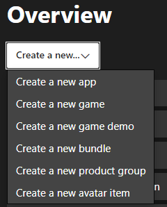
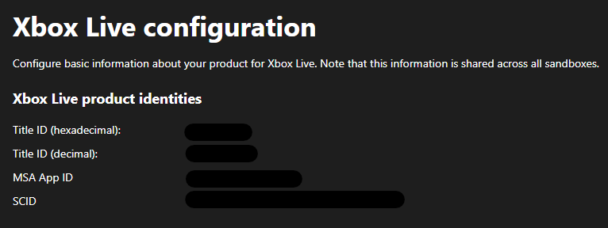

# Xbox Live Game Binding overview

Use this topic to set up two console products that share the Xbox Live service configuration.  

> **NOTE:** Please contact your Microsoft account manager to begin using the Xbox Live Game Binding feature. 

## What is it?

You can configure two titles to share the same Xbox Live configuration.  

A *primary product* is an Xbox Live-enabled title that's configured by using Partner Center. All changes and publishes to Xbox Live occur in this product. All Xbox Live configuration changes impact both products.  

A *secondary product* is initially enabled, and content is approved by Microsoft. It shares Xbox Live service configurations with the primary product. 

At the core of the Xbox Live Game Binding feature is a Partner Center configuration change so that two or more products can share the same Xbox Live configuration. A change is also made to the packaged metadata of the secondary product. During the setup process, there aren't any required changes made to the primary product.

### Benefits

With Xbox Live Game Binding, two separate products are created so that if you want to put more resources into creating the Xbox Series version of a title, you can sell the Xbox Series and Xbox One products separately.  

This method is ideal if you want to keep your userbase intact across multiple console generations.  

You can use Xbox Live Game Binding for a seamless gaming experience for users who purchase multiple versions of the title and want to resume game progression and achievement unlocks.  

> **NOTE:** This doesn't require any changes to the primary title, and you can flexibly add a secondary version later.
  
  
## Policy and use of Xbox Live Game Binding
  
The following are policies you're required to agree to before using Xbox Live Game Binding.

 * The title only binds console products together, such as the Xbox Series version of the title to the Xbox One version of the title. 
 * The title only selects the platforms it's using for game binding in Partner Center. 
   * There's special work that must be done to support cross-generational play. 
   > **NOTE:** If the title only supports the Xbox One family of consoles for the binding, we don't recommend selecting the Xbox Series family of consoles as a supported platform. As a workaround, you can add the cross-generational play capability to your multiplayer configuration.
 * All titles that share the primary title configuration are close to carbon copies of the original, or they're the same title with a stripped-down experience. 
   * Ensure that there's a clear distinction between the product offerings in the store to set the right expectation with users. 
 * Once the secondary product has released to GA, it can't be unbound. Binding and unbinding titles is only supported while the secondary product is in production and isn't released to users. 
 * Titles are comfortable with Xbox Live changes that are made to bound products.
 * No versions are currently running on Windows PC.

> **NOTE:** There are plans to expand the scope and offerings of this feature. 

## What if you want to use Xbox Live Game Binding with Windows PC?

If you want to configure Xbox Live for your title, ingest the Windows PC package to your existing game and expand it to include Windows PC as a supported platform.  

At this time, Windows PC titles can't share configurations with console titles by using the XBL Game Binding feature. If a title has a Windows PC version, we recommend that you share all packages within a single product. 

## What has been tested by the feature team?

To ensure that we have absolute confidence in this feature, we have tested Xbox Live at all stages of Xbox Live Game Binding. This includes testing before binding, as the product is bound, and after binding the products. 

To ensure that there's transparency when testing this feature, we have performed all known Xbox Live experiences for a product.  

We used the samples that ATG provides and called the same APIs that our customers call to access various Xbox Live features.  

For our testing, it was essential that all products were in a working state during the binding process so that you can test this feature while actively developing your title. 

## How to set up Xbox Live Game Binding

Use the following sections and steps to set up and configure your title for Xbox Live Game Binding. This process requires work on the secondary product, but it doesn't require work for the primary product.  

> **NOTE:** Don't start configuring your product for Xbox Live Game Binding until the feature team has onboarded customers to use the feature.

### Entering the flight 
  
Please contact your Microsoft account manager to begin using Xbox Live Game Binding. They can enable the feature on your behalf.  

Once your studio is in the flight, you can access the feature for all future products. 

### Primary product setup in Partner Center 
  
If you haven't created your product in Partner Centre, use the following steps to set up your primary, Xbox Live-enabled product.  

 1. Navigate to Partner Center and create the primary product you want to enable for Xbox Live configuration. 
 1. Contact your Microsoft account manager to assist in setting up and approving your product. For more information about Partner Center, see [Partner Center Documentation](https://docs.microsoft.com/en-us/partner-center/).
 1. Configure Xbox Live as you normally would. 
 1. To test your product, publish the content to your desired sandbox.  
 
With the primary product enabled for Xbox Live, you can access all the relevant Xbox Live identifiers that are needed for your secondary product.

### Secondary product setup in Partner Center
  
Now it's time to set up your secondary product with access to the Xbox Live configuration in your primary product.  

 1. Create the secondary product by using Partner Center. Enable the product as a game by selecting **Create a new...** > **Create a new game** as shown in the following screenshot.
    >
 1. Contact your Microsoft account manager with your business justification for using Xbox Live Game Binding between this secondary product and your primary product. 
    * Ensure that you meet the criteria for game binding in your business justification.
    * After approval from your Microsoft account manager, both of your products are Xbox Live-enabled.
 1. When selecting the correct platforms for your secondary product, ensure that **Windows 10 PC** isn't selected. Windows PC isn't supported for Xbox Live Game Binding. 
    > **NOTE:** If you want to use cross-generational play with your product, ensure that you've added that capability in Partner Center.
 1. From your secondary product, select **Xbox Live** > **Gameplay settings**. 
 1. From the top-right of the page, select **Bind Configuration** as shown in the following screenshot.
    >
 1. After selecting **Bind Configuration**, use the details on the page to bind your secondary product to your primary product. Enter the Product Name or Store ID of the primary product, and then select **Save** as shown in the following screenshot.  
    >
 1.	After selecting **Save**, an internal process sets up your secondary title. 
    > **NOTE:** This process doesn't impact the primary product, and it only makes changes to the secondary product’s configuration as shown in the following screenshot.  
    > 
 
After the process completes, the page refreshes with the Xbox Live configuration of the primary product shown within the secondary, and it will remain as read-only.  

To edit the configuration, select the **Edit** button. This button takes you to the primary product to make changes. Changes that are made to a Xbox Live configuration impact both versions of the title.  

> **NOTE:** If you want to unbind the products, you can do so via the **Unbind Configuration** button. This option restores your previous Xbox Live configuration for the secondary product.  
>  
>If you want to bind another product to your primary product, complete the steps above for a new secondary product.  

You can view all bound products that are bound together from the primary title.  

### Secondary product package setup
  
After completing the steps from the section Secondary product setup in Partner Center in this topic, you can set up your secondary game package.  

To find the correct identifiers that are under the secondary product, select **Xbox Live** > **Xbox Live Settings** as shown in the following screenshot.  
  

  
If your secondary title is built by using the Microsoft Game Development Kit (GDK), use the TitleID and Identity of the *MicrosoftGame.config* file that's on the **Xbox Live configuration** page. 

If your secondary title is built by using the Xbox Development Kit (XDK), use the Identity, TitleID and SCID in the *Package.appmanifest* file that's found on the **Xbox Live configuration** page. 

> **NOTE:** Within the configuration of the secondary product, please ensure that you only test in sandboxes that are configured and set up in the configuration of the primary product. For example, testing Xbox Live features won't work if Xbox Live isn't configured in that sandbox. 

## Frequently Asked Questions
  
### Should I include additional identifiers in my secondary product that are found in my primary product?
  
No, you should only use the specific primary identity details that are found in the game setup page of the secondary product.  

For example, each product should have their own unique MSA App ID to avoid any unforeseen consequences.  

### What happens if I unbind the secondary product?
  
The previously configured Xbox Live configuration becomes viewable and editable again from the secondary product. In other words, this restores the secondary product to the unbound state.  

From there, you can make changes that are independent of the primary product. However, you must make changes to the package for the secondary product to access Xbox Live features from the secondary product.  

The unbinding process has no effect on the primary product.

## Summary
  
You have greater flexibility with Xbox Live Game Binding to differentiate products between console generations while keeping their user communities intact.