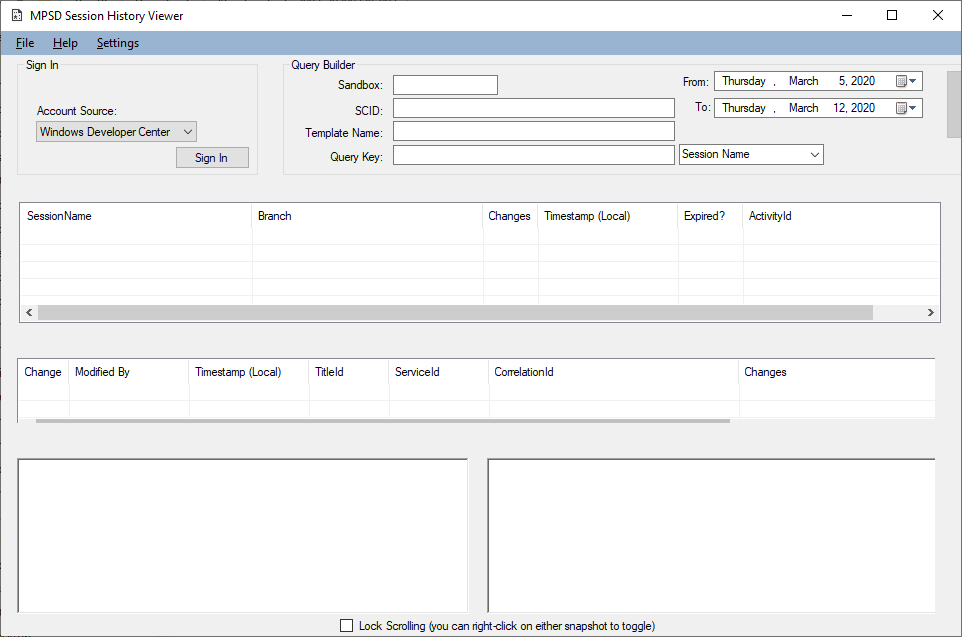

# Multiplayer Session History Viewer (MultiplayerSessionHistoryViewer.exe)

Multiplayer Session History Viewer enables you to view a historical timeline of all changes over a multiplayer session document's history (including deleted documents).
Using this tool gives a deeper understanding of what is happening with an MPSD session document as it changes over time.

The tool will only show sessions for a few days.

This standalone tool is part of `XboxLiveTools.zip`; see [Development tools for Xbox Live](live-tools.md).

<!-- .chm: -->
<!--  -->
<!-- dmc: -->

## Access Control

Partner Center has certain setup requirements in order to support using a dev's account to sign in to Multiplayer Session History Viewer.
The publisher of the title must give permission for that dev to run session history queries for that title.

Someone on your developer team with Partner Center access needs to go to the Partner Center page for your company, select **Access Management**, and then select the appropriate group.
A real user must be added to this group.
Developer accounts can then be created and added to this group.

Those developer accounts are given to people who need access to the title's query data via the Multiplayer Session History Viewer.
An administrator for your company can create their own developer account to test out tool access through running test queries.

## Viewing changes to the session document

1. In Windows Explorer, double-click `MultiplayerSessionHistoryViewer.exe`. The Multiplayer Session History Viewer appears.

2. Specify a sandbox, SCID, template name, and "query key" (either a session name, gamertag, xuid, or request correlationId) along with a search date range.
   Then click the **Query** button.

3. If this is the first query for that sandbox, an access control flow dialog box appears, requesting your email and password (see "Access Control" above).
   The tool won't ask for access credentials until a valid query is made.

4. If the credentials are valid, the query runs, and any MPSD sessions that match the query criteria are displayed in the top listview control, along with metadata.

5. Select a session or a change.

If multiple sessions are found, selecting any one of them in the top section will pull down all changes ever made to that session, along with metadata for each change.

Selecting a single change will download and show the complete MPSD document state for that change.

If you multi-select two different changes, a colored diff view will appear, highlighting differences between the two versions of the session.
Meaning of colors in the diff view:
* Blue - something changed.
* Yellow - something was added.
* Red - something was removed.

To keep the line numbers matched up on each side for easier comparison, enable lock-scrolling.
